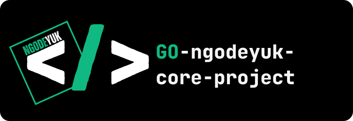

<p align="center"></p>
<h2 align="center">Go-ngodeyuk-core-project</h2>

## 🚀 Tech Stack
   - [Go](https://go.dev/)
   - [Gin](https://gin-gonic.com/)
   - [Gorm](https://gorm.io/index.html)
   - [Postgresql](https://www.postgresql.org/)
   - [Docker](https://www.docker.com/)

## 📖 Structure

Know folder structure of this application first :
[structure](./docs/structure.md).
For api specs, you can see it [here](/docs/specs/readme.md)

### 🧞 Simple Running Project

if you use `Linux` or `WSL` you can use a script.

#### how to run?

- Make sure the script is executable:
  ```bash
  chmod -R +x scripts/
  ```
- Running docker for database :
  - Run docker
     ```bash
      ./scripts/docker.sh up
      ```
  - Stop docker
     ```bash
      ./scripts/docker.sh down
      ```
- Running main app :
  ```bash
   ./scripts/run.sh
  ```
- Running testing app :
   ```bash
   ./scripts/test.sh
   ```

## 🚀 Contribute

How to contribute?
1. Fork the Repository:
   - Go to the [repository page](https://github.com/ngodeyuk/go-ngodeyuk-core-project).
   - Click on the "Fork" button in the top-right corner of the page.
   - This will create a copy of the repository in your own GitHub account.
  
2. Clone Your Fork:
   ```bash
   git clone https://github.com/yourusername/go-ngodeyuk-core-project.git
   cd go-ngodeyuk-core-project
   ```

3. Create a Branch:
   ```bash
   git checkout -b your-feature-branch
   ```

4. Make Your Changes:
   - Add your features or bug fixes.
   - Ensure your code follows the project's coding standards.

5. Commit Your Changes:
   ### examples:
   ```sh
   git add .
   git commit -m "build: features(users) register service"
   ```
   ### Rules `commit` :
   - `build` : used when you want to create something new.
   - `feat` : used when you want to add features to existing code.
   - `refactor` : used when you want to change existing code.
   - `fix` : used when you have successfully fixed a bug.
   - `docs` : used when you have written project documentation.
  
6. Create a Pull Request:
   - Go to the original repository.
   - Click on the `Pull Requests` tab.
   - Click on the `New Pull Request` button.
   - Select your feature branch from the "compare" dropdown.
   - Click `Create Pull Request` and provide a description of your changes.
  
## ⚙️ License

This project is licensed under the MIT License - see the [LICENSE](/LICENSE) file for details.